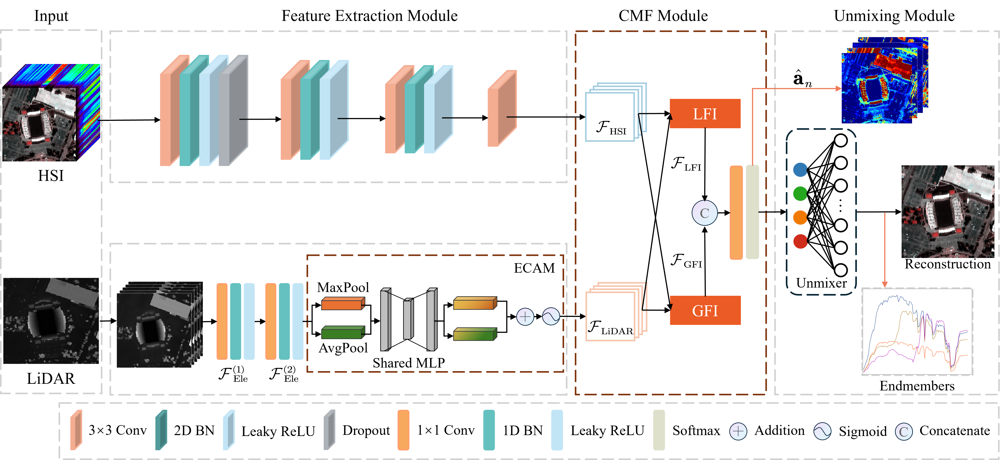

# MSSF-Net: A Multimodal Spectral-Spatial Feature Fusion Network  for Hyperspectral Unmixing
The code in this toolbox implements the MSSF-Net: A Multimodal Spectral-Spatial Feature Fusion Network  for Hyperspectral Unmixing.
More specifically， it is detailed as follow.


# Generate Attribute Profile

The attribute profiles for LiDAR is applied based on the research work of [Dr.Liao](https://telin.ugent.be/~wliao/Partial_Reconstruction/). How to use the code can refer to this
```matlab
num_scales = 2;
MPNeachpca = getmorphprofiles(DSM, 'euclidean', 'square', num_scales);
MPN = cat(3, MPNeachpca, DSM);
```

# Citation
Please kindly cite the papers if this code is useful and helpf for your research.
